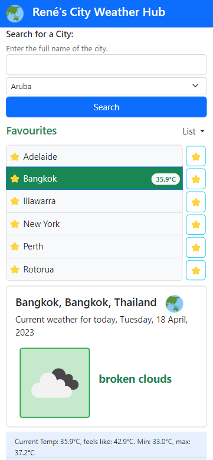
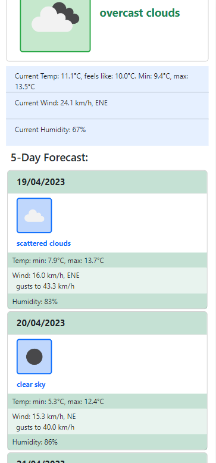

# Rene's City Weather Hub

This web application displays the current weather and a five-day forecast of a user-selected city. It allows the user to search for a city in a chosen country, and if it is found the city is saved to a list of recent searches. The user can then click on an item in a selected list to display the weather for that city. Cities can be favourited, which are listed separately. Selectable lists are: Search History, Favourites,  Australian Capital Cities, New Zealand Cities and World Cities.

## Table of Contents

- [Features](#features)
- [Installation and Usage](#installation-and-usage)
- [Technologies Used](#technologies-used)
- [Screenshots](#screenshots)
- [Live URL and Repository](#live-url-and-repository)
- [Credits](#credits)
- [Contributing](#contributing)
- [License](#license)

## Features

 This app will run in the browser and features dynamically updated HTML and CSS powered by jQuery, Bootstrap, Javascript and external APIs. It utilises the Day.js library to work with date and time. The application is responsive and adapts to different screen sizes.

 It uses the OpenWeatherMap API to retrieve latitude and longitude and weather data for the selected city. It uses the World Bank API to retrieve a list of countries and their ISO 3166-2 country code.

 It saves data in local storage so that the search history and favourites persist when the user refreshes the page. Weather data is not persisted, as it is retrieved from the OpenWeatherMap API each time the user searches for or selects a city from a list.

The application has the following features:

- It has a search form that allows the user to enter the name of a city
- It has a dropdown list of countries that the user can select from
  - The list of countries and their ISO 3166-2 country code is populated from the World Bank external API one time, then it is saved to local storage
- It has a Search button that allows the user to search for a city
- It has a dropdown menu that allows the user to select a list of cities:
  - Search History
    - a list of cities that the user has searched for
    - the list is saved to local storage
    - a button allows the user to remove the city from the Search History list
    - a button allows the user to toggle the city on to or off the Favourites list
  - Favourites
    - a list of cities that the user has favourited
    - the list is saved to local storage
    - a button allows the user to to toggle the city on to or off the list
  - Australian Capital Cities
    - a list of Australian capital cities
    - a button allows the user to toggle the city on to or off the Favourites list
  - New Zealand Cities
    - a list of major New Zealand cities
    - a button allows the user to toggle the city on to or off the Favourites list
  - World Cities
    - a list of major cities from around the world
    - a button allows the user to toggle the city on to or off the Favourites list

- Each list item has a badge that is populated with the current temperature if the city has been selected in the current session.

- It has a Current Weather section that displays the current weather for the selected city
  - The section is populated with the following data from the OpenWeather API:
    - City name, State name and Country name
      - A map emoji also displayed opens a new tab in the user's browser and displays the city using OpenStreetMap
    - The Date at the user's location
    - OpenWeatherMaps's representative weather icon and description
    - Temperature details
      - Current temperature
      - 'Feels like' temperature
      - Minimum temperature
      - Maximum temperature
    - Humidity
    - Wind speed, direction and gust speed (if available)
- It has a Five Day Forecast section that displays the weather forecast for the selected city for the next five days
  - The section is populated with the following data from the OpenWeather API:
    - The Date at the user's location
    - OpenWeatherMaps's representative Weather icon and Description
    - Temperature details
      - Minimum temperature
      - Maximum temperature
    - Humidity  
    - Wind speed, direction and gust speed (if available)

## Installation and Usage

Clone the repository to your local machine and open the `index.html` file in your browser to view the city weather hub application, or go to the [live site](#live-url-and-repository).

Open the application in your web browser and use the interface as described above.

## Technologies Used

- HTML
- CSS
  - CSS Variables
- Bootstrap CSS Framework
  - Grid System
  - Responsive Design
  - UI Components
- JavaScript
  - DOM Manipulation
  - Event Listeners
  - Event Handlers
  - Local Storage
  - Functions
  - Classes
  - API Calls
- Day.js
  - Date and Time Library
- jQuery
  - DOM Manipulation

## Screenshots

### Desktop Browser - Showing the Search History List

### Mobile Browser - Showing the Favorites List

### Desktop Browser - Error Message Modal

### Mobile Browser - World Cities List

## Live URL and Repository

The live application can be accessed at the following URL: [Rene's City Weather Hub](https://renemalingre.github.io/renes-city-weather-hub/)

The repository can be accessed at the following URL: [Rene's City Weather Hub Repository](https://github.com/ReneMalingre/renes-city-weather-hub)

## Credits

- OpenWeatherMap.org for the weather data: [OpenWeather API](https://openweathermap.org/api)

- Bootstrap for the responsive UI elements and CSS framework - [Bootstrap 5.2.3](https://getbootstrap.com/)

- Help from Mozilla [MDN Web Docs](https://developer.mozilla.org/) and OpenAI's [ChatGPT](https://chat.openai.com/chat) for providing insights into JavaScript, Bootstrap, jQuery, Day.js, Fetch() and async await functionality.

- Day.js v1.11.7 for the date and time library: [Day.js](https://day.js.org/)

- jQuery v3.6.4 for the JavaScript library: [jQuery](https://jquery.com/)

## Contributing

Contributions to this project will not be accepted, as this project is an assessment piece for a coding course, and it must be the project author's own work. However, feel free to fork the repository and make your own changes.

## License

This project is licensed under the terms of the MIT license.

© 2023 René Malingré
